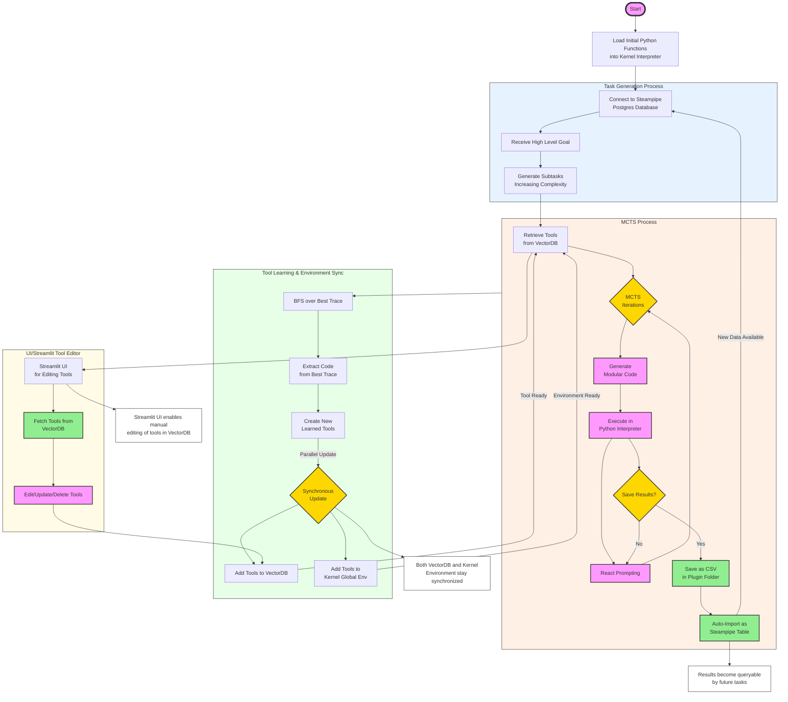
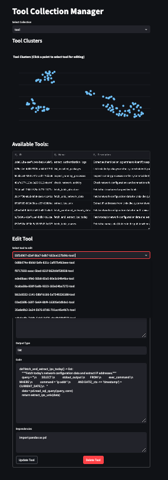

# 🚀 Quarry: Simplifying LLM Agents with a SQL/Python-First Approach

**Quarry** is your all-in-one solution for building powerful agents using [steampipe](https://steampipe.io/) with a SQL/Python-First approach.
No more wrestling with APIs—just install the right plugin from the [Steampipe Hub](https://hub.steampipe.io/) and start querying.

🔎 Zero ETL → Fetch real-time data from APIs directly into SQL.

🔄 Modular & Extensible → Combine SQL pipelines and Python functions to build intelligent agents.

🧠 Smart Reasoning → Leverage Monte Carlo Tree Search (MCTS) for advanced decision-making.

## ⚙️ Key Principles
- **SQL + Python Only**: Simple, clean, and powerful—no extra tools needed.
- **Modular Tool Learning**: Build and refine Python functions as reusable tools. 
- **Advanced Reasoning**: MCTS with self-evaluation improves code generation and task-solving. 
- **Human-in-the-Loop**: Seamlessly review, correct, and enhance generated tools.

### 🌱  Optional

### Get Better Results with Curriculum Learning

Start simple. Gradually increase task complexity to improve performance and reasoning.

###  🔄 Share the previous results using CSV plugin

- Use `csv` plugin. 
- Include `def Save_results_in_CSV` tool with `workdir` being consistent with path in:

```
 ~/.steampipe/config/csv.spc
```

This way you can use the memory of previous results as another table in Postgres/Steampipe

## 🏗️ Architecture Overview



## 🔧 Requirements

**1. Install Steampipe**

Download and install from  [steampipe](https://steampipe.io/).

**2. Install Plugins**

Install relevant plugins. For the demo (no API keys required):
```commandline
steampipe plugin install exec
steampipe plugin install finance
steampipe plugin install csv
```

**Start the service**:

`steampipe service start --show-password`

## 🚀 Running Quarry 

**Estimate LLM Cost:**

Cost ≈ num_actions * depth_limit *  n_iters * 2 LLM calls
- num_actions: Candidates per iteration 
- depth_limit: MCTS depth 
- 2: For generation + evaluation


**env variables (steampipe postgres and LLM keys)** 

Set your env variable in `.env file`:

```
DB_HOST=host.docker.internal if using docker 
DB_PORT=
DB_NAME=
DB_USER=
DB_PASSWORD=
OPENAI_API_KEY=
ANTHROPIC_API_KEY=
```

### Run in Docker for Safety

Modify your goal prompt in src/quarry/local.py (demo code) and run:

```bash
sh quarry.sh
```


### Run the Demo without Docker

**Install UV Package Manager**

Install from [uv](https://docs.astral.sh/uv/getting-started/installation/):

```commandline
uv venv --python 3.12
uv run demo
```

## 🛠️ Inspect & Improve Learned Tools


Not all generated tools will be perfect!
Use our Streamlit UI to review, edit, and enhance them:

```commandline
uv run streamlit run tool-collection-manager.py
```

## 🔄 Extend Quarry

Want to expand beyond Steampipe?
Check out [Vanna AI](https://github.com/vanna-ai/vanna) for adapting Quarry to other databases.

**🙏 Acknowledgements**
   
- [Vanna AI](https://github.com/vanna-ai/vanna)
- [LLM Reasoners](https://github.com/Ber666/llm-reasoners)
- [Adobe Dynasaur](https://github.com/adobe-research/dynasaur)
- [Self-Refine: Improving LLMs with Self-Feedback](https://arxiv.org/abs/2305.16291)

##🌱 Future releases ##

- Training codes for finetuning the base LLM models to reduce cost in MCTS search.


**⭐️ Show Your Support!**

If you find Quarry useful, please star ⭐ this repository and share it!
Feedback and contributions are always welcome. 😊
